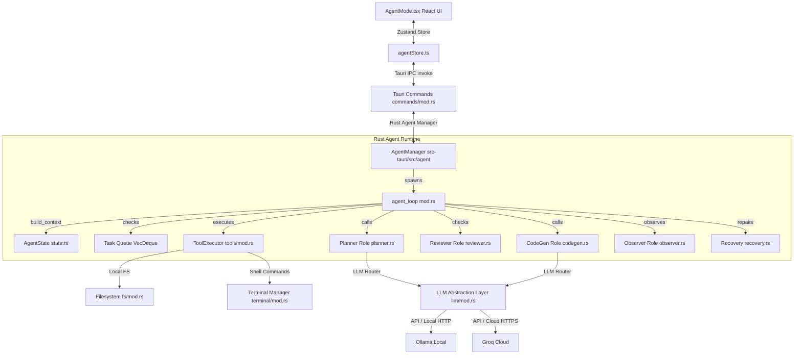

# Vaelon Agentic Architecture Walkthrough & Diagnostic Report

This document provides a thorough walkthrough of the Vaelon Agent's architecture, details why the agent was behaving like a basic chat assistant instead of an active developer, and documents the fixes applied to the codebase.

---

## 1. Vaelon Agentic Architecture Overview

Vaelon is a local-first application built with a React frontend and a Tauri/Rust backend. It implements two main operational modes:
1. **Knowledge Mode (Mode 1)**: Dedicated to document management, OCR, and quiz generation, utilizing a standard **AI Assistant** chat panel (`AIPanel.tsx`).
2. **Agent Mode (Mode 2)**: An autonomous coding space (`AgentMode.tsx`) that implements a continuous reasoning loop capable of planning, file writing, command execution, and error recovery.

### System Architecture Flow

The interaction between the frontend UI, Zustand stores, Tauri IPC bridge, and the Rust agent execution layer is shown below:



---

## 2. Detailed Breakdown of the Reasoning Loop

When a goal is initiated from the frontend, the agent loop executes up to 50 iterations:

1. **Context Construction**: `AgentState::build_context` generates the prompt context, combining:
   - The user's target **Goal**.
   - Current **Workspace** paths.
   - List of **Files Created/Modified** during the current session.
   - **Workspace Tree** (the directory structure).
   - Summaries of **Completed Actions** and **Recent Thoughts**.
   - Capped **Observations** (stderr/stdout logs from previous tools).
2. **Action Planning**: The loop checks the `task_queue`. If empty, it calls `planner::plan_next` with the context, asking the LLM to return a single structured JSON `Action` (e.g. `WRITE_FILE`, `RUN_COMMAND`, `THINK`).
3. **Code Generation & Review**: If the planned action is `WRITE_FILE`, the loop invokes `codegen::generate` to produce file content, followed by `reviewer::review_file` (heuristic validation checking syntax, matching brackets, and warning about dangerous patterns).
4. **Execution**: The action is executed via `ToolExecutor::execute` which interfaces with Tauri's shell wrapper or filesystem commands.
5. **Observation**: The `observer::observe` component captures output, exit codes, and errors, compiling them into a structured `Observation`.
6. **Self-Healing / Recovery**: If a tool fails (e.g., missing package, nonexistent directory), `analyze_failure` in `recovery.rs` constructs repair tasks (e.g. `npm install`, `mkdir -p`) and prepends them to the queue for immediate resolution.
7. **Verification**: If the planner signals `DONE`, the loop runs completion checks and shuts down.

---

## 3. Findings: Why the Agent was Behaving like an Assistant

We identified three critical bugs/limitations in the agent codebase causing the system to behave like a standard chat assistant rather than an agent:

### 1. Groq Cloud Mode Ignored JSON Constraints (`groq.rs`)
The `planner::plan_next` function requests JSON mode (`json_mode: true`) to force the LLM to output a structured planning action. However, in `src-tauri/src/llm/groq.rs`, the blocking complete function `complete_blocking` **did not check or pass the `response_format` configuration**:
```rust
// Old code in groq.rs (complete_blocking):
let body = json!({
    "model": settings.groq_model,
    "messages": req.messages.iter().map(|m| json!({"role": m.role, "content": m.content})).collect::<Vec<_>>(),
    "temperature": req.temperature.unwrap_or(0.3),
    "max_tokens": req.max_tokens.unwrap_or(2000),
    "stream": false,
});
// (response_format was missing here!)
```
Because of this, when running in Cloud mode (using Groq), the model would ignore system constraints and respond with normal conversational chat (e.g. *"Here is the next step you should take..."*). This caused the JSON parser in `planner.rs` to crash, failing the run.

### 2. Blind Initial Context (`state.rs`)
In the original design, the agent was given no initial workspace files list. Unlike the JavaScript agent design, the Rust agent had no `WorkspaceScanner`. When it started, the `WORKSPACE TREE` was missing entirely. Without knowing which files existed, the agent was completely blind. It could not select files to read or edit and frequently fell back to trying to explain things or failing.

### 3. Weak Default LLM Model (`llm/mod.rs`)
The default LLM model for Groq was configured to `"llama-3.1-8b-instant"`. While fast, 8B models struggle with complex agent loops, multi-step tool reasoning, and strict JSON format compliance, frequently defaulting to conversational assistant behavior.

---

## 4. Applied Fixes

We have modified the codebase to resolve these three issues:

### 1. Enabled JSON Response Formats in Groq (`src-tauri/src/llm/groq.rs`)
Added support for JSON response format constraint checking in `groq::complete_blocking`:
```diff
     let client = Client::new();
-    let body = json!({
+    let mut body = json!({
         "model": settings.groq_model,
         "messages": req.messages.iter().map(|m| json!({"role": m.role, "content": m.content})).collect::<Vec<_>>(),
         "temperature": req.temperature.unwrap_or(0.3),
         "max_tokens": req.max_tokens.unwrap_or(2000),
         "stream": false,
     });
+
+    if req.json_mode {
+        body["response_format"] = json!({"type": "json_object"});
+    }
```

### 2. Added Recursive Workspace File Tree Scanner (`src-tauri/src/agent/state.rs`)
Introduced a path walking routine (`scan_workspace`) that indexes up to 4 levels of project structure (skipping noise directories such as `.git`, `node_modules`, `dist`, `target`, and `package-lock.json`) and formats it into the prompt context:
```rust
fn scan_workspace(workspace_path: &str) -> String {
    let mut files = vec![];
    let root = std::path::Path::new(workspace_path);
    
    fn walk(dir: &std::path::Path, prefix: &str, files: &mut Vec<String>, depth: usize) {
        if depth > 4 { return; }
        if let Ok(entries) = std::fs::read_dir(dir) {
            let mut sorted_entries: Vec<_> = entries.filter_map(Result::ok).collect();
            sorted_entries.sort_by_key(|e| (!e.path().is_dir(), e.file_name()));
            
            for entry in sorted_entries {
                let name = entry.file_name().to_string_lossy().to_string();
                if name == "node_modules" || name == ".git" || name == "target" || name == "dist" || name == "build" || name == "package-lock.json" || name == "tmp" {
                    continue;
                }
                
                let is_dir = entry.path().is_dir();
                if is_dir {
                    files.push(format!("{}{}/", prefix, name));
                    walk(&entry.path(), &format!("{}  ", prefix), files, depth + 1);
                } else {
                    files.push(format!("{}{}", prefix, name));
                }
            }
        }
    }
    
    walk(root, "", &mut files, 0);
    if files.is_empty() {
        "  (empty or failed to read)".to_string()
    } else {
        files.join("\n")
    }
}
```
This is injected into the context block returned by `build_context` under `WORKSPACE TREE`.

### 3. Upgraded Default Model (`src-tauri/src/llm/mod.rs`)
Updated the default Groq cloud model to `"llama-3.3-70b-versatile"`. This model has strong instruction-following capabilities, reliably returns parseable JSON actions, and executes complex reasoning steps.
